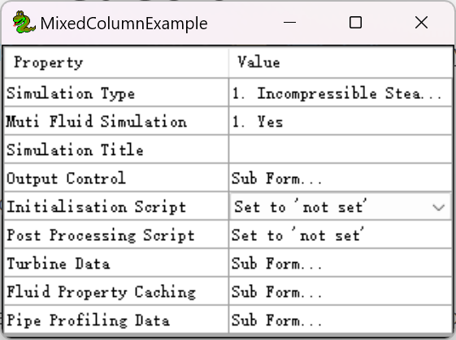

# DataGridViewMixedColumn

This is a DataGridView control for WinForms, which supports inserting various types of editing controls in a single column.

- TextboxEditingControl
- ComboboxEditingControl
- NodeEditingControl which can go to the next level

### Example

     

